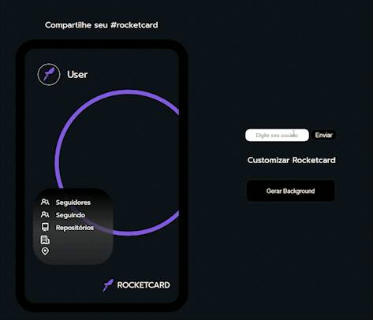

## Desafio Rocket Card

# Descrição do projeto
Ao inserir um usuário na página, o card como mostrado na imagem traz informações vindas do API do GitHub, como o nome de usuário (login), a foto de perfil (avatar) e informações como: a quantidade de seguidores, quantos usuários o usuário está seguindo, localização e a empresa em que está trabalhando.
Além disso, há o botão para personalizar a cor externa do card.

# Ferramentas utilizadas
-HTML
-CSS
-JAVASCRIPT
-API GitHub